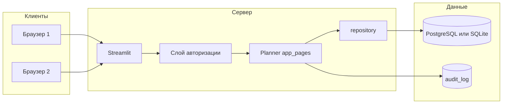

# Масштабирование Planner на многопользовательское использование

## Текущее состояние (кратко)

- **Стек:** Streamlit, SQLite (один файл), Pandas, Plotly. Одно подключение к БД на сессию Streamlit (`st.session_state["_db_conn"]`).
- **Данные:** [Planner-2.0/database.py](Planner-2.0/database.py) — схема и миграции; [Planner-2.0/repository.py](Planner-2.0/repository.py) — все операции с БД принимают `conn`.
- **Логирование:** [Planner-2.0/utils/app_logging.py](Planner-2.0/utils/app_logging.py) — три логгера (БД, действия, ошибки); `get_actions_logger()` уже используется в app_pages для записи действий (роли, сотрудники, проекты, отпуска, импорт, очистка). **Нет привязки к пользователю** — многопользовательский аудит отсутствует.
- **Авторизация:** отсутствует.
- **Установка:** Windows через Inno Setup ([installer/](installer/)); Linux не описан.

Цель — сохранить работу текущего сценария (однопользовательский, SQLite) и добавлять возможности по шагам.

---

## Целевая архитектура (высокоуровнево)

- **Сервер:** приложение устанавливается на сервер (Windows или Linux), доступ по сети (Streamlit по умолчанию слушает порт 8501; для продакшена — обратный прокси и/или bind 0.0.0.0).
- **Авторизация:** отдельный слой (экран входа, сессия, проверка доступа). После входа — идентификатор пользователя доступен во всём приложении и передаётся в аудит.
- **СУБД:** абстракция доступа к БД; поддержка SQLite (как сейчас) и PostgreSQL для многопользовательской нагрузки.
- **Аудит:** расширение текущего логирования действий — каждая запись привязана к пользователю (или "anonymous" до внедрения авторизации); опционально таблица `audit_log` в БД для выборок и отчётов.

---

## Рекомендуемый порядок внедрения и зависимости

| #   | Шаг                                            | Зачем раньше других                                                                                                     |
| --- | ---------------------------------------------- | ----------------------------------------------------------------------------------------------------------------------- |
| 1   | Аудит действий с идентификатором пользователя  | Не зависит от БД и авторизации; сразу вводим поле "кто" (пока anonymous/session_id). Позже подставим реального user_id. |
| 2   | Абстракция доступа к БД + поддержка PostgreSQL | Позволяет перенести данные на серверную СУБД без смены логики приложения; миграции и репозиторий остаются общими.       |
| 3   | Авторизация (пользователи, вход, сессия)       | После этого подставляем реального пользователя в аудит и ограничиваем доступ к приложению.                              |
| 4   | Серверная установка и запуск (Windows/Linux)   | Документация и скрипты развёртывания; привязка к хосту/порту и (при необходимости) к обратному прокси.                  |
| 5   | Роли и разграничение прав (опционально)        | Расширение авторизации: не только "вошёл/не вошёл", но и "что разрешено".                                               |

Шаги 1–4 можно внедрять по одному: после каждого приложение остаётся рабочим (в том числе в текущем однопользовательском режиме с SQLite).

---

## Детализация шагов

### Шаг 1. Аудит действий с идентификатором пользователя

**Цель:** каждая запись в логе действий содержала идентификатор "пользователя" (до появления авторизации — anonymous или session_id), плюс опционально структурированный аудит в БД для выборок.

**Что делать:**

- Ввести в приложении контекст "текущий пользователь для логов": например `st.session_state.get("_audit_user_id")` или `_audit_username` (по умолчанию `"anonymous"`).
- Расширить API логирования действий: например `log_action(action_name, details=None, user_id=None)` в [Planner-2.0/utils/app_logging.py](Planner-2.0/utils/app_logging.py), который пишет в `get_actions_logger()` строку с меткой времени, user_id/username, действием и деталями (в т.ч. entity id где есть).
- Постепенно заменить прямые вызовы `get_actions_logger().info(...)` в [app_pages](Planner-2.0/app_pages/) на `log_action(...)` с единым форматом (например: `timestamp | user_id | action | details`).
- Опционально: добавить таблицу `audit_log` (id, created_at, user_id, action, entity_type, entity_id, details JSON/text) и записывать туда те же события — это даст возможность отчётов "действия пользователя X за период" без разбора файла логов.

**Не трогаем:** БД приложения (роли, сотрудники, проекты и т.д.), авторизацию, тип СУБД. Текущая функциональность не меняется.

**Оценка:** 2–3 дня. **Файл пошагового плана:** [multi_user/01_audit_user_actions.md](multi_user/01_audit_user_actions.md).

---

### Шаг 2. Абстракция доступа к БД и поддержка PostgreSQL

**Цель:** один и тот же код репозитория и миграций работал с SQLite (по умолчанию, как сейчас) и с PostgreSQL для серверного многопользовательского режима.

**Что делать:**

- Ввести слой абстракции подключения: фабрика `get_connection()` в [Planner-2.0/database.py](Planner-2.0/database.py) в зависимости от конфига возвращает соединение SQLite или psycopg2. Все вызовы в [repository.py](Planner-2.0/repository.py) и остальном коде продолжают принимать `conn` и выполнять SQL.
- Конфиг: например `PLANNER_DB_TYPE=sqlite|postgres`, для PostgreSQL — `DATABASE_URL` или отдельные переменные (host, port, user, password, dbname). Для SQLite оставить текущую логику `PLANNER_DB_PATH` и fallback в `%LOCALAPPDATA%`.
- Схема и миграции: вынести DDL в отдельные шаги миграций с проверкой "уже применено"; для PostgreSQL заменить SQLite-специфичные конструкции (INTEGER PRIMARY KEY AUTOINCREMENT → SERIAL/BIGSERIAL, BOOLEAN 0/1 → true/false, PRAGMA убрать).
- Репозиторий: по возможности использовать только такой SQL, который совпадает в SQLite и PostgreSQL; отличия вынести в database.py или маленькие хелперы (last inserted id, текущая дата БД).
- Зависимости: добавить в requirements.txt `psycopg2-binary` (или условный импорт при использовании PostgreSQL).

**Результат:** по переменным окружения можно переключить приложение на PostgreSQL без изменения сценариев использования; локальная разработка и текущий установщик остаются на SQLite.

**Оценка:** 4–6 дней. **Файл пошагового плана:** [multi_user/02_db_abstraction_postgres.md](multi_user/02_db_abstraction_postgres.md).

---

### Шаг 3. Авторизация

**Цель:** только аутентифицированные пользователи получают доступ к приложению; в аудит подставляется реальный user_id (из шага 1).

**Что делать:**

- Модель: таблица `users` (id, username, password_hash, display_name, created_at, is_active и т.д.) в той же БД; миграция в database.py.
- Регистрация/управление: либо только ручное добавление пользователей (скрипт или отдельная админ-страница), либо форма регистрации с одобрением — по политике организации.
- Вход: отдельная страница/экран до основного меню. Пароль хранить только в виде хеша (bcrypt или passlib). Сессия: после успешной проверки сохранять в `st.session_state` user_id и/или username; проверять при каждом переходе по разделам.
- Защита маршрутов: в [Planner-2.0/Planner.py](Planner-2.0/Planner.py) перед загрузкой основного контента проверять наличие "вошедшего" пользователя; если нет — показывать форму входа (и не рендерить дашборд, проекты и т.д.).
- Интеграция с аудитом: при наличии `st.session_state["user_id"]` передавать его в `log_action(...)` (шаг 1); иначе оставить "anonymous" только для страницы входа.
- Выход: кнопка "Выйти" — очистка сессии и редирект на экран входа.

**Без изменения:** бизнес-логика планирования (проекты, этапы, сотрудники, отпуска); разграничение прав "кто что может редактировать" — отдельный шаг (шаг 5).

**Оценка:** 3–5 дней. **Файл пошагового плана:** [multi_user/03_authentication.md](multi_user/03_authentication.md).

---

### Шаг 4. Серверная установка и запуск (Windows и Linux)

**Цель:** приложение можно устанавливать и запускать на сервере под Windows или Linux, с доступом по сети и (по желанию) за обратным прокси.

**Что делать:**

- Конфигурация сервера Streamlit: в [.streamlit/config.toml](Planner-2.0/.streamlit/config.toml) или через переменные окружения задать `server.address = "0.0.0.0"` (или аналог через env) для прослушивания всех интерфейсов; при необходимости `server.port`, `server.baseUrlPath`, включение CORS.
- Документация и скрипты:
  - **Windows:** расширить [installer/README.md](installer/README.md) разделом "Установка на сервер Windows": установка в каталог с правами на запись БД/логов, автозапуск (NSSM/служба или планировщик заданий), рекомендация по обратному прокси (IIS, nginx, Caddy) для HTTPS и при необходимости базовой защиты.
  - **Linux:** новый документ (например `docs/deploy_linux.md` или в корневом README): установка Python/venv, клонирование или копирование приложения, переменные окружения (DB, auth), запуск через systemd (unit-файл) с `streamlit run Planner.py`, пример nginx/Caddy перед Streamlit для HTTPS и (опционально) аутентификации на уровне прокси.
- Установщик Windows: при необходимости добавить режим "серверная установка" (другой каталог по умолчанию или отдельный пункт в мастере), не меняя текущий сценарий "персональная установка".
- Не обязательно, но полезно: пример `.env.example` с переменными `PLANNER_DB_TYPE`, `DATABASE_URL`, `PLANNER_DB_PATH`, путём к логам и т.д.

**Оценка:** 1–2 дня. **Файл пошагового плана:** [multi_user/04_server_deployment.md](multi_user/04_server_deployment.md).

---

### Шаг 5. Роли и разграничение прав (опционально)

**Цель:** не только "вошёл/не вошёл", но и "просмотр только" / "редактирование" / "админ" (управление пользователями, конфигурация, очистка данных).

**Что делать:**

- Роли пользователей: таблица `user_roles` или поле `role` в `users` (например: viewer, editor, admin). Админ может управлять пользователями и критичными разделами (очистка данных, конфигурация); editor — все данные планирования; viewer — только просмотр.
- Проверки в UI и при вызовах репозитория: перед рендером страниц "Очистить данные", "Конфигурация", "SQL-запросы" и перед опасными операциями проверять роль; при отсутствии прав — сообщение и запрет действия.
- Опционально: привязка прав к разделам меню (скрывать пункты, к которым нет доступа).

**Оценка:** 2–3 дня. **Файл пошагового плана:** [multi_user/05_authorization_roles.md](multi_user/05_authorization_roles.md).

---

## Сводка по оценкам

| Шаг | Задача                                        | Оценка   |
| --- | --------------------------------------------- | -------- |
| 1   | Аудит действий с идентификатором пользователя | 2–3 дня  |
| 2   | Абстракция БД + PostgreSQL                    | 4–6 дней |
| 3   | Авторизация                                   | 3–5 дней |
| 4   | Серверная установка (Windows/Linux)           | 1–2 дня  |
| 5   | Роли и разграничение прав (опционально)       | 2–3 дня  |

**Старт:** логично начать с **шага 1 (аудит)**: быстрый результат, нет риска для БД и авторизации, закладывается основа для "кто что сделал" после появления пользователей.

---

## Папка с файлами задач

В папке [.cursor/plans/multi_user/](multi_user/) для каждого шага заведён отдельный файл с чекбоксами и правилом: перед реализацией пункта — согласовать шаги, после выполнения — отметить итоги в файле.

- `01_audit_user_actions.md` — формат логов, `log_action`, опционально таблица `audit_log`.
- `02_db_abstraction_postgres.md` — фабрика подключений, миграции под SQLite/PostgreSQL, конфиг.
- `03_authentication.md` — таблица users, вход/выход, сессия, связь с аудитом.
- `04_server_deployment.md` — config, документация Windows/Linux, systemd, обратный прокси.
- `05_authorization_roles.md` — роли, проверки доступа к разделам и операциям.

---

## Важные замечания

- **Streamlit:** сессия привязана к браузеру; "сессия пользователя" для авторизации — это по сути состояние в `st.session_state`. Для усиленной безопасности можно добавить короткоживущий токен в cookie (если Streamlit это позволит) или держать авторизацию на обратном прокси.
- **Производительность СУБД:** для многопользовательского режима PostgreSQL предпочтительнее SQLite (конкурентная запись, блокировки, масштабирование). SQLite оставляем для локальной работы и тестов.
- **Логирование действий:** уже есть файл planner_actions.log; шаг 1 унифицирует формат и добавляет "пользователя", при необходимости — таблицу для запросов и отчётов.

